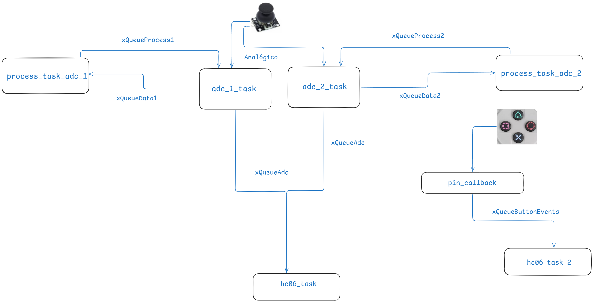
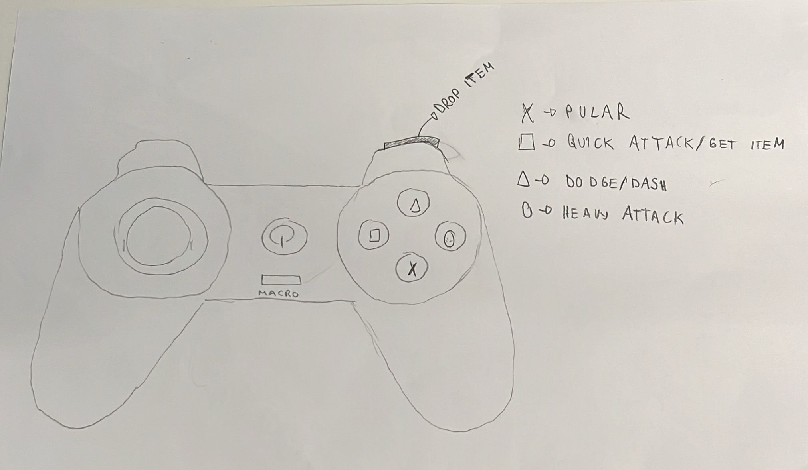

# RP2040 freertos

basic freertos project, with code quality enabled.

# Controle Personalizado para Brawlhalla - APS 2

## Jogo
**Brawlhalla** é um jogo de luta online gratuito onde até oito jogadores podem se enfrentar em diferentes arenas, usando uma variedade de personagens e habilidades. A jogabilidade dinâmica e competitiva exige precisão nos controles e respostas rápidas aos comandos dos jogadores.

## Ideia do Controle
Este projeto consiste na criação de um controle personalizado inspirado no clássico controle do PS1, com uma modificação importante: substituímos as setas direcionais por um joystick analógico. Essa alteração oferece mais controle e precisão durante as partidas de Brawlhalla, proporcionando movimentos mais suaves e rápidos.

## Inputs e Outputs
O controle terá os seguintes componentes principais:
- **Joystick Analógico:** Substitui as setas direcionais para controle dos movimentos do personagem.
- **Botões:** Controlam ações como ataques, pulo, defesa, entre outros comandos essenciais do jogo.
- **Haptic Feedback (opcional):** Se implementado, fornecerá feedback tátil através de vibrações durante eventos importantes do jogo, melhorando a imersão.

## Diagrama de Blocos

## Imagens e Links

